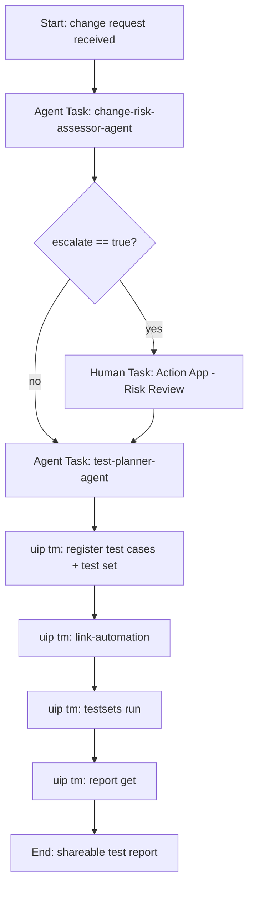

# Agentic Testing Workshop Guide

Live editable version: https://claude.ai/artifact/V8XFL5vTviqKPRwnY8owtx
Companion planning doc (design rationale, open items): https://claude.ai/artifact/ELSjMVPaKWzFiT5SJGYeWc

As of: 2026-09-23 — **first draft**. Sections marked ⚠️ contain mechanics inferred from product
documentation but not yet run end-to-end — verify before delivering live.

Participant's guide for the Agentic Testing Workshop: build a chain of coding-agent-built agents — risk
assessment, test planning, and test execution — orchestrated end to end against the live BenefitConnect demo app.

## Prerequisites

- **Node.js (LTS)** — verify with `node --version`
- **A coding agent** — this guide uses Claude Code: `npm install -g @anthropic-ai/claude-code`
- **The UiPath CLI:** `npm install -g @uipath/cli@latest` — verify with `uip --version`
- **UiPath coding-agent skills installed:**
```
claude plugin marketplace add https://github.com/UiPath/skills
claude plugin install uipath@uipath-marketplace
uip skills install
```
Confirm `uipath-agents`, `uipath-maestro-bpmn`, `uipath-human-in-the-loop`, and `uipath-test` appear in the
output. (`uipath-rpa` is only needed for the Optional Module.)
- **Authenticate to the workshop tenant:**
```
uip login --authority https://cloud.uipath.com --organization <org> -t <tenant>
```
- **Studio Web access** for publishing/running/debugging agents
- **UiPath Test Manager access** for Module 2 (⚠️ Preview capability — confirm your tenant has it enabled)
- **Studio Desktop (Windows only)** — only required for the Optional Module

**Test target:** the BenefitConnect demo portal at `https://accrual-bp-hri.azurewebsites.net/login`. Demo
accounts (password `Accrual!2026` unless noted): `jordan`, `leilani`, `priya`, `marcus`; admin account is
`admin`/`admin`.

**Provided by your instructor** (you won't build these yourself): a pre-built Maestro/BPMN process shape for
Module 2, a pre-built "Risk Review" Action App, the `Run-EnrollmentWizard-Test` RPA workflow, and a known-good
fallback output for Module 1's agent in case your own build needs debugging.

## Module 1 — Build the Change Risk Assessor Agent

**Goal:** learn the describe → generate → validate → publish → run loop by building a simple agent that scores
the business risk of a change to BenefitConnect.

**What you'll build:** an agent that reads a change request and scores it across five risk dimensions, then
decides whether the change needs human review before testing begins.

### Steps

**1. Set up your working folder**
```
mkdir change-risk-assessor
cd change-risk-assessor
mkdir samples
```
Download the two sample change requests provided by your instructor into `samples/`:

| Change request | Scenario |
| --- | --- |
| `CR-1001-button-label.pdf` | Low risk — relabel a button in the enrollment wizard |
| `CR-2004-adoption-life-event.pdf` | High risk — add a new "Adoption" life event type |

**2. Open your coding agent and give it this instruction:**

```
Using the UiPath agent skill, generate a low-code agent named
"change-risk-assessor-agent". The agent takes two file inputs:

Inputs:
- in_ChangeRequestPDF — the change request / user story (PDF)
- in_SystemContextPDF — a short document describing the BenefitConnect area
  affected (business criticality, compliance sensitivity)

The agent evaluates the change across these five risk dimensions:
1. Business criticality — does it touch a critical path (enrollment,
   payroll data, compliance-sensitive fields)?
2. Change scope — how many components/screens/APIs does it touch?
3. Regulatory/compliance sensitivity — PII, benefits eligibility, audit
   trail impact?
4. Test coverage gap — is this area already covered by existing tests
   (per the system context document)?
5. Change type risk — new feature vs. modifying existing critical logic
   vs. a simple bug fix (modifying existing critical logic is highest risk)

Return output matching this structure:

{
  "out_riskLevel": "low | medium | high | critical",
  "out_riskSummary": "string — plain-language explanation of the decision",
  "out_riskAssessmentJSON": {
    "change_id": "string",
    "escalate": "boolean — true if this change needs human review before test planning",
    "risk_factors": {
      "business_criticality": { "result": "low|medium|high", "detail": "string" },
      "change_scope": { "result": "low|medium|high", "detail": "string" },
      "compliance_sensitivity": { "result": "low|medium|high", "detail": "string" },
      "coverage_gap": { "result": "low|medium|high", "detail": "string" },
      "change_type_risk": { "result": "low|medium|high", "detail": "string" }
    },
    "recommended_test_priority": "string — what to test first and why"
  }
}

- Any risk_factor result of "high" that relates to business_criticality or
  compliance_sensitivity should set escalate = true.
- Do not infer information not explicitly present in the two input documents.
- Write the system prompt with property-and-casualty/enterprise-SaaS change
  management best practices in mind.
```

**3. Watch it scaffold.** Claude Code will create a solution, initialize the agent inside it, write the system
prompt, configure the input/output schema, and run a validate step. Approve each step as it goes.

**4. Upload and open in Studio Web**
```
uip solution upload change-risk-assessor-solution --output json
```
Open the returned `DesignerUrl` in Studio Web.

**5. Run both sample scenarios**
In Studio Web, click **Debug**, provide `in_ChangeRequestPDF` and `in_SystemContextPDF`, and run each scenario:
- `CR-1001-button-label.pdf` should come back `out_riskLevel: "low"`, `escalate: false`
- `CR-2004-adoption-life-event.pdf` should come back `out_riskLevel: "high"` or `"critical"`, `escalate: true`

*Exact wording will vary — what should match is the structure and each factor's result, since this is
LLM-generated text.*

**Stuck?** Your instructor has a known-good version of this agent's output — use it to unblock yourself for
Module 2 rather than getting stuck debugging Module 1 indefinitely.

**Done.** You've built, published, and run your first agent — the foundation for the orchestrated flow in
Module 2.

## Module 2 — Orchestrate Risk → Test Plan → Test Manager Execution

**Goal:** chain Module 1's agent into a Maestro-orchestrated flow: escalated changes get a human risk review,
then a new test-planner agent designs scenarios, and real UiPath Test Manager executes and reports on them
against the live BenefitConnect enrollment wizard.

### 1. Walk the pre-built Maestro process

Open the process your instructor provided and trace the shape:



### 2. Inspect the pre-built "Risk Review" Action App

Open it and note how it turns structured JSON into a form — you will never see or edit raw JSON here:

- **Read-only:** change title, risk level badge, plain-language summary, bulleted risk factors with detail,
  recommended test priority
- **Your input as reviewer:** a Decision dropdown (`Approve as assessed` / `Override risk level`); if you
  override, a Risk Level dropdown appears plus a required Notes field
- **On submit**, the app writes `{ risk_level_final, override_applied, reviewer_notes, reviewer, timestamp }`
  back into the process — this is what the next agent reads.

### 3. Build the Test Planner Agent

```
Using the UiPath agent skill, generate a low-code agent named
"test-planner-agent".

Inputs:
- in_ChangeRequestPDF — the change request document (PDF)
- in_RiskAssessmentJSON — structured risk assessment (JSON), which may
  contain reviewer overrides: risk_level_final, override_applied,
  reviewer_notes

Design a test plan for the BenefitConnect enrollment wizard, scoped ONLY to
these wizard steps: login, plan_selection, dependents, beneficiaries,
life_events, confirm. Do not propose tests outside the enrollment wizard.

For each scenario:
- Base priority on the risk factors in in_RiskAssessmentJSON. A "high" or
  "critical" factor tied to validation logic (e.g. beneficiary percentages,
  life-event type rules) must produce at least one "high" priority scenario
  covering that validation.
- Use risk_level_final if present, otherwise the original risk level.
- Do not invent business rules not stated in the inputs — flag assumptions
  in coverage_notes instead.

Return output matching this structure:

{
  "out_TestPlanSummary": "string",
  "out_TestPlanJSON": {
    "change_id": "string",
    "test_scenarios": [
      {
        "id": "TC-01",
        "title": "string",
        "priority": "high | medium | low",
        "wizard_step": "login | plan_selection | dependents | beneficiaries | life_events | confirm",
        "persona": "jordan | leilani | priya | marcus",
        "action": "string — what should be done, step by step",
        "expected_result": "string — what to verify"
      }
    ],
    "coverage_notes": "string"
  }
}
```

Publish and run this agent the same way as Module 1 (`uip solution upload`, run in Studio Web).

### 4. ⚠️ Register and run the plan in Test Manager

**This section uses UiPath Test Manager (`uip tm`), a Preview capability. The exact command outputs below are
based on the `uipath-test` skill's documented command surface, not a verified end-to-end run — confirm each
step works in your tenant before delivering this live, and adjust if `link-automation` doesn't support
per-scenario runtime inputs the way assumed here.**

Ask your coding agent to take `out_TestPlanJSON` and:

1. Create or reuse a Test Manager project: `uip tm project list --filter <name>` then `uip tm project create` if needed
2. For each scenario, create a test case and steps:
```
uip tm testcases create --project-key <KEY> --name <scenario title>
uip tm testcases steps add --project-key <KEY> --test-case-id <id> --description <action>
```
3. Group them into a test set: `uip tm testsets create --project-key <KEY> --name "Enrollment Wizard — <change_id>"`, then `uip tm testcases add --test-set-key <KEY> --test-case-keys <...>`
4. Link each case to the automation: `uip tm testcases link-automation --project-key <KEY> --test-case-key <KEY> --folder-key <FOLDER> --package-name Run-EnrollmentWizard-Test --test-name <name>`
5. Run the set: `uip tm testsets run --test-set-key <KEY>` — returns an execution ID
6. Get the report: `uip tm report get --execution-id <ID> --project-key <KEY>`

**Open Test Manager in the browser** after steps 2–3 (see the test cases and test set with linked automation),
after step 5 (watch live pass/fail per case), and after step 6 (read the persona-tailored report) — don't let
this stay CLI-only.

### 5. Run both sample scenarios end-to-end

- **Low-risk** (`CR-1001-button-label.pdf`): confirm it skips the Action App entirely and flows straight
  through to test planning and Test Manager execution.
- **High-risk** (`CR-2004-adoption-life-event.pdf`): confirm it pauses at the Action App, you submit a review
  decision, and the flow resumes into test planning with your (possibly overridden) risk level, then real
  RPA-driven checks run against the live enrollment wizard, producing a pass/fail report in Test Manager.

**Stuck on Module 1's output?** Swap in the instructor-provided known-good version so you can still complete
Module 2.

## Optional Module — Build the Enrollment Wizard Test Robot Yourself

**Optional. Windows + UiPath Studio Desktop required.**

**Goal:** instead of using the instructor-provided `Run-EnrollmentWizard-Test`, build it yourself using Claude
Code with the `uipath-rpa` skill.

A coding agent can reason about and write XAML, but it can't visually browse a live web page the way it reads
a PDF. This skill is "discovery-first" — you capture the UI targets before the agent generates anything.

### Steps

**1. Set up your working folder**
```
mkdir enrollment-wizard-robot
cd enrollment-wizard-robot
```
Open it in both Studio Desktop and your coding agent's terminal.

**2. Capture the target screens first**
Using Studio's UI Explorer/Recorder against `https://accrual-bp-hri.azurewebsites.net/login`, manually walk
through: sign in as `jordan` / `Accrual!2026`, then step through plan selection → dependents → beneficiaries →
life events → confirm. Save the captured elements into the project's Object Repository.

**3. Give the coding agent the build instruction**

```
Using the uipath-rpa skill, generate a Studio Desktop workflow project named
"Run-EnrollmentWizard-Test" for UI-testing the BenefitConnect enrollment
wizard at https://accrual-bp-hri.azurewebsites.net.

Use the Object Repository elements already captured for: login, plan
selection, dependents, beneficiaries, life events, and confirm.

Inputs:
- in_WizardStep — one of: login | plan_selection | dependents | beneficiaries | life_events | confirm
- in_Persona — one of: jordan | leilani | priya | marcus (all password Accrual!2026)
- in_Action — string describing the step-specific action to perform
- in_ExpectedResult — string describing what to verify after the action

Build one dispatcher workflow that switches on in_WizardStep and routes to
one child workflow per step. Each child workflow must:
- Log in as in_Persona if not already authenticated
- Perform in_Action using the existing Object Repository selectors
- Verify in_ExpectedResult using a Get Text / Verify Expression activity
- Wrap the step in Try Catch: a caught exception (e.g. selector not found)
  must set status to "blocked", never "pass" or "fail"

Known business rules to validate when relevant:
- Beneficiary allocation percentages must sum to 100
- Life event submissions must use a valid QLE type

Return output arguments matching:
{
  "id": "string — passed through from the caller",
  "status": "pass | fail | blocked",
  "actual_result": "string",
  "evidence": "string — e.g. screenshot path or captured text"
}

Never default to "pass" on ambiguity — only report pass when the verification
activity actually succeeded.
```

**4. Watch it scaffold.** Approve each step as Claude Code creates the dispatcher and child workflows, wires in
your Object Repository selectors, and adds error handling.

**5. Debug locally in Studio Desktop.** Before trusting it in a larger flow, confirm you get a real `pass`, a
real `fail` (e.g. feed a beneficiary split that doesn't sum to 100), and a real `blocked` (e.g. point it at a
stale selector) at least once each.

**6. Publish to Orchestrator** as `Run-EnrollmentWizard-Test`.

**7. Re-wire Module 2.** Swap the instructor-provided workflow reference for your own via
`uip tm testcases link-automation`, then re-run both sample scenarios end-to-end and confirm you get the same
shape of results.

**⚠️ Caveat:** the exact CLI/publish subcommands above are based on the `uipath-rpa` skill's catalog
description, not a verified trace — confirm against `uip --help` and the skill's own guidance during a dry run
before finalizing.

## You did it!

You've built a chain of coding-agent-built agents — risk assessment, test planning, and (via real UiPath Test
Manager) execution and reporting — orchestrated end to end against a live application. That's the same
describe → generate → validate → publish → run loop you'll use for every agent you build after this, now
applied across a full testing workflow instead of a single agent.

### Next steps

- Try the flow against a change request you write yourself, not just the two provided samples
- Explore the `uipath-test` skill's Playwright packaging path as a lighter-weight alternative to RPA for pure
  web scenarios
- Consider extending the flow with a real trigger (Integration Service webhook, Jira story closing) instead of
  manually supplying a change request
- Send feedback on anything that felt rough — both Test Manager (`uip tm`) and `uipath-rpa` are
  Preview/actively evolving surfaces
