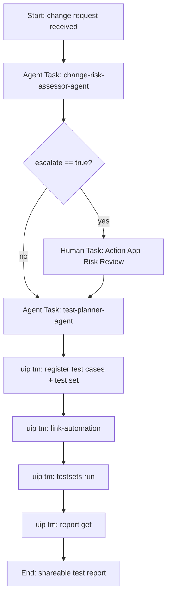

# 1. Walk the pre-built Maestro process

Open the process your instructor provided and follow its shape:

The gateway reads the `escalate` flag produced by the agent you built in Module 1:

- **Low-risk** changes go straight to the test-planner agent.
- **Escalated** changes pause at a human task until a reviewer submits the Risk Review form.
